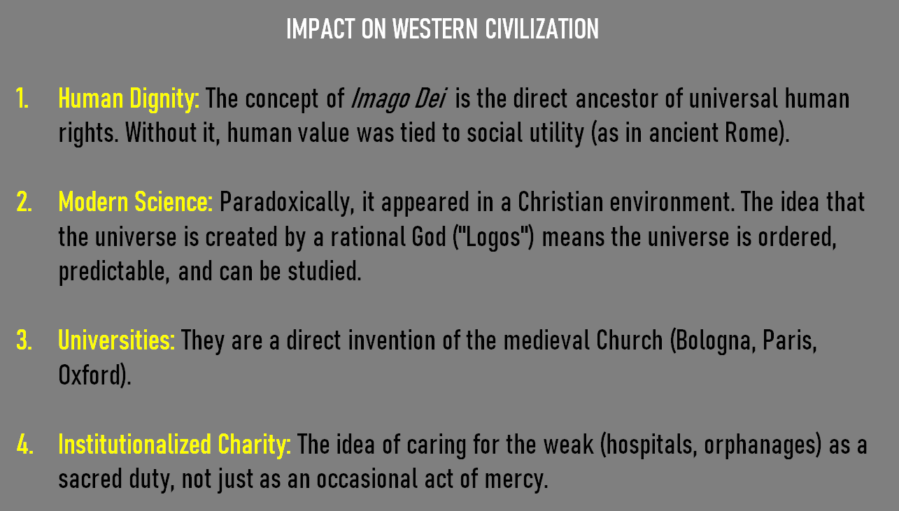
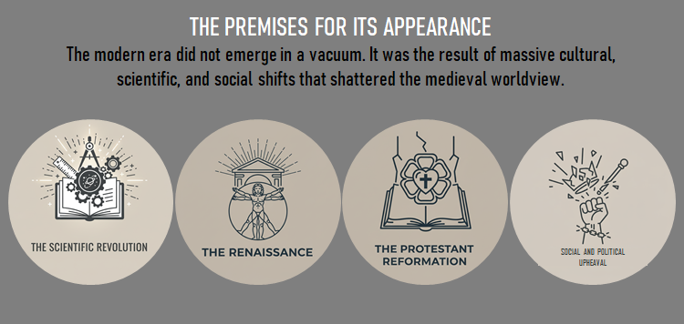

# Pregătire pentru biletele de la examenul de filozofie

# 1. Worldview 

# 2. Metoda socratică. Arta de a pune întrebări 

# 3. Metoda socratică. Conceptul de a te cunoaște pe tine însuși 

# 4. Plato. Alegoria peșterii 

# 5. Artistotel. 4 cauze 

# 6. Aristotle. Golden mean 

# 7. Christian thought. How it formed western thought 

## 1. Human Dignity 

- The concept of Imago Dei is the direct ancestor of universal human rights. 

- Without it, human value was tied to social utility (as in ancient Rome). 

## 2. Modern Science 

- Paradoxically, it appeared in a Christian environment. 

- The idea that the universe is created by a rational God ("Logos") means the universe is ordered, predictable, and can be studied. 

## 3. Universities 

- They are a direct invention of the medieval Church (Bologna, Paris, Oxford). 

## 4. Institutionalized Charity 

- The idea of caring for the weak (hospitals, orphanages) as a sacred duty, not just as an occasional act of mercy. 

# 8. Modern Philosophy. What is it, premises, 2 main currents (bonus: the philosophers of the movements)

**Modern Philosophy** is characterized by a decisive turn toward reason, individualism, and scientific methodology, moving away from religious authority as the primary sources of truth.

**Premises:**

- **Scientific Revolution:**
- **The Renaissance**
- **The Protestant Reformation**
- **Social and Political Upheaval**

**Two Main Currents:**

1.  **Rationalism**
    - **Core Tenet:** Certain knowledge can be derived through reason and logical deduction alone, independent of sensory experience. The mind possesses innate ideas or principles.
    - **Key Philosophers:** **René Descartes**, **Baruch Spinoza**, **Gottfried Wilhelm Leibniz**.

2.  **Empiricism**
    - **Core Tenet:** All knowledge originates in sensory experience. The mind at birth is a *tabula rasa* (blank slate), and concepts are built from impressions.
    - **Key Philosophers:** **John Locke**, **George Berkeley**, **David Hume**.

---

# 9. Modern Philosophy. Francis Bacon. The 4 idols (the names will be given and you will have to define each)

**Francis Bacon** described four categories of mental obstacles, or "idols," that distort human perception and hinder scientific progress.

**The Four Idols:**

1.  **Idols of the Tribe (Idola Tribus)**
    - **Definition:** These are flaws inherent in human nature itself. We are all prone to wishful thinking, oversimplifying complex issues, and seeing patterns and order where none exist.
    
    - **Example:** Thinking that the sun moves around the earth because it looks that way.

2.  **Idols of the Cave (Idola Specus)**
    - **Definition:** These are the personal biases of an individual. Your unique upbringing, education, favorite books, and personal experiences create a "cave" that colors how you see the world.
    
    - **Example:** A person trained in mathematics might think everything can be explained by numbers.
    

3.  **Idols of the Marketplace (Idola Fori)**
    - **Definition:** These are errors that come from language. We use words that are ambiguous or refer to things that don't even exist. People can end up debating the meaning of words rather than the nature of reality.
    
    - **Example:** Arguing endlessly about the word “nature” or “soul” without defining it properly.
    

4.  **Idols of the Theater (Idola Theatri)**
    - **Definition:** These are flawed philosophical systems (like Aristotle's) that are accepted without question. Bacon saw these as "stage-plays" that present a fictional, neat-and-tidy version of the world that doesn't match reality.
    
    - **Example:** Accepting Aristotle’s philosophy or Church doctrines or scientism as absolute truth without testing them by observation or experiment.
    

---

# 10. Modern Philosophy. Descartes. The Basis method (bonus: Bacon vs Descartes)

**René Descartes** (1596–1650), the father of modern rationalism, established a method of radical doubt to find an indubitable foundation for knowledge.

**Descartes' Method (Methodic Doubt / Cartesian Method):**
1.  **He doubts his senses:** A stick in water looks bent, but it's straight. Our senses can deceive us, so they cannot be the foundation.

2.  **He doubts the physical world (The Dream Argument):** How do I know I'm not in an elaborate dream right now? There are no 	certain signs to distinguish waking life from a dream. Therefore, I must 	doubt the existence of the entire external, physical world.

3.  **He doubts reason itself (The Evil Demon Argument):** This is his hyperbolic (extreme) doubt. He imagines a "malicious demon" (un 	malin génie ) with god-like power who is dedicated to deceiving him. This 	demon could be making him believe that 2+2=4 when it is, in fact, something else. This allows him to doubt even mathematics and logic.

4. After doubting everything, Descartes is left in a void of total uncertainty. But in this void, he finds one, single, indubitable truth: "Cogito, ergo sum." (I think, therefore I am.)

---

# 11. Modern Philosophy. German Idealism. Kant. Rationalism – Empiricism. Categorical Imperative (Morality)

**German Idealism** was a dominant philosophical movement in late 18th and early 19th century Germany. It reacted to Kant's philosophy by emphasizing that reality is fundamentally mental or spiritual, constructed by the mind or absolute spirit.

**Immanuel Kant** (1724–1804) aimed to resolve the conflict between Rationalism and Empiricism and establish a secure foundation for both science and morality.

**Kant's Synthesis of Rationalism and Empiricism (in *Critique of Pure Reason*):**
- **The Problem:** Rationalists claim pure reason can know reality. Empiricists claim all knowledge comes from sense data, making metaphysics impossible.
- **Kant's Solution (The "Copernican Revolution"):** Knowledge is not the mind conforming to objects, but **objects conforming to the mind's inherent structures**.
    - **A posteriori knowledge:** The *content* of knowledge comes from sensory experience (Empiricism).
    - **A priori knowledge:** The *form* or structure of knowledge (space, time, and 12 categories like causality) is provided by the mind itself (Rationalism).
- **Conclusion:** We can have certain, universal knowledge about the world *as it appears to us* (the phenomenal world), but we cannot have theoretical knowledge about reality *as it is in itself* (the noumenal world, e.g., God, soul, free will).

**Categorical Imperative (Moral Philosophy in *Critique of Practical Reason* & *Groundwork*):**
Kant's deontological (duty-based) ethics is grounded in pure practical reason. The **Categorical Imperative** is an unconditional moral command that applies to all rational beings.

**Main Formulations:**
1.  **The Universal Law Formulation:** Before you do something, ask: "What if everyone  did this all the time?"  If the action becomes self-contradictory (e.g., "If everyone lied, no one would believe anyone, and lying would be impossible"), then it is morally forbidden.
    

3.  **The Humanity Formulation:** Don't use people. All rational beings have intrinsic worth and autonomy. You must respect their dignity and not treat them as mere tools for your own goals.

# 12. Nihilism. Nietzsche. What it is, premises, main ideas, his solutions 

# 13. Existentialism. Sartre. Definitii de baza, concepte, explica existenta precede esenta 

# 14. Existentialism. Camus. Absurdism. Meaning of life 

# 15. Postmodernism. Identity. Identitate fragmentata. Id. F. vs Id. stabila. (bonus: tip de ontologie: slab vs tare) 

# 16. Postmodernism. Language, in modernism vs in postmodernism, metanaratives, authors death 

# 17. Posthumanism. Post vs trans, their roots, what is common, the difference, how we apply it (AI?) 

# 18. Transdiciplinarity. Defineste cele 3 axiome, multi vs ... vs trans 

# 19. Philosophy of the mind. Reductionism. What is it, how we apply it here, subject, perception, mind - body 